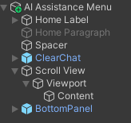

# AR RAG Application
The project is the development of an Augmented-Reality Virtual-Assistant Application which have an RAG functionality with diverse capabilities to answer the user's query based on the provided external data on a Hololens-2 device. 

## Use Cases
The main idea of this application is to create a Virtual Assistant that can help and guide users to operate a system or a machine on an industrial level work-environment. The Virtual Assistant will able to assist the user with the appropriate context from the external data such as the machine's user manual, etc. It can also help the user pin point to the area of interest that correlates to the problem. 

## Technologies
- Frontend: Unity Engine
- Server: FastAPI with Uvicorn
- LLM: Finetuned llama3.2 (Ollama)
- Vector Database: Milvus
- Text Extraction: Mistral OCR
- Evaluation: RAGAS

## Features
The list of features for this applications are: 
- QnA with the assistant
- Message history and clear history
- Access to external data
- Visual cues to help guide users about the machine
- Keyboard and speech-to-text to interact with the assistant 

# How to Set Up
The repo consist of the necessary MRTK3 Toolkit components, `UnityProjects>AR-RAG-Project` for the Unity Project Folder, and `rag-system` for the RAG server codes. 

## Requirements
MRTK3 requires Unity 2021.3.21 or higher. In addition, you need the [Mixed Reality Feature Tool for Unity](https://aka.ms/mrfeaturetool) to find, download, and add the packages to your project.

# Detailed Documentation
The application consist of 3 main menu panel which are: Home Menu Panel, Frequent Inquiries Panel, and AI Assistant Panel. There's also palm-up menu which show the additional control and setting for the application. This application main logic uses GameManager to manage the overall control and logic of the application. 

## Home Menu Panel

In the Unity, Home Menu panel will contain several child gameobjects that make the heading text informations and the buttons that will go to the Frequent Inquiries Panel and AI Assistant Panel. 

## Frequent Inquiries Panel

Frequent Inquiries will contain several child gameobjects that make the heading text informations and the buttons that will provide predefined prompts to the AI Assistant about the machine. 

For each buttons within the frequent inquiries panel, there's should be a 'Pressable Button' component which should have 'GameManager.OnChangePanel' to the AI Assistant Panel and 'GameManager.OnFrequentInquiries' to the predefined queries for the AI Assistant. We can just change the value for the '.OnFrequentInquiries' to have a new queries. When doing this, don't forget to also change the 'text' value within the button gameobject

## AI Assistant Panel

This panel contain several child gameobjects that make the heading text informations, buttons to clear chat, inputfield, mic, and send buttons. In this panel, there's also a Scroll View gameobject that will be use for the chat messages place. 

To make the chat messages object appears as a message app, we instantiate a new message bubble inside this 'Content' gameobject and use 'Vertical Layout Group' which makes all the child gameobjects inside it automatically structured cleanly. 

The important logic will happen when we press the Send Button. First it will close down the mic / speech-to-text functionality. Then it will create a bubble message for the user's message, the message will be put into the 'chatManaget.SendQuery' method to get the Asssistant's response. It will then create another bubble message for the response message. 

## Palm-Up Menu

This specific menu panel will appears when the user's hand gesture shows a palm-up gesture. It contain several child gameobjects, mainly the buttons that will control the user's flow for the application. 

## GameManager Object

This gameobject contain the important script to manage the logic of the application. It has the 'Message State' to store the chat history, the Menu Panels to handle the menu transitions, others gameobject to handle the chat messages logic. There's also 'ChatRAGManager' that handle the connection to the running RAG server. 

# (NOTE)
All projects under the Mixed Reality Toolkit organization are governed by the Steering Committee. The Steering Committee is responsible for all technical oversight, project approval and oversight, policy oversight, and trademark management for the Organization. To learn more about the Steering Committee, visit this link: https://github.com/MixedRealityToolkit/MixedRealityToolkit-MVG/blob/main/org-docs/CHARTER.md
